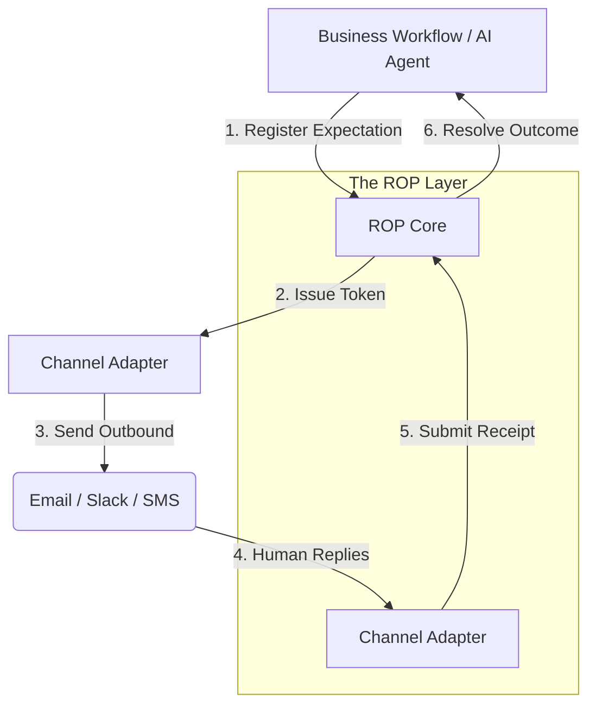

# About ROP: The Connective Tissue for the Agentic Era

## The Gap: Why ROP?

In the early eras of computing, we solved **Service-to-Service** communication (REST, gRPC) and **Human-to-Human** communication (Email, Slack). But the **Agentic Era** has introduced a new, messy friction point: **The Asynchronous Delegation Loop.**

When an AI agent (the Requester) sends a message to a human (the Responder) and needs to wait for a reply to "resume" its task, the system currently breaks in three ways:

1.  **Context Fragmentation:** The agent "forgets" the state or has to burn tokens re-reading a 50-email thread to "guess" if a "👍" means "Approve the invoice" or "I saw your cat picture."
2.  **State Drift:** If a human replies to an old thread, or forwards a thread to a colleague who then replies, the system may accidentally complete an action that was already settled, superseded, or revoked.
3.  **The Wait-State Tax:** Systems today either "hang" (polling) or require bespoke, fragile webhook plumbing for every single channel (Email, SMS, WhatsApp).

**ROP was created to turn "Human-in-the-Loop" into a computational primitive.** It is a transport-neutral protocol that ensures every reply is deterministic, authorized, and idempotent.

---

## Architecture: The Layer Cake

ROP sits above the messy transport layer and below your business logic. It provides the "Resume" signal for your agents.

---

## 10 Scenarios for the Agentic Era

### 1. The Multi-Step Financial Approval
An agent prepares a $50k purchase order. It needs approval from both the Dept. Head and the CFO. ROP tracks both registrations; the agent "suspends" until both ROP outcomes return `completed`.

### 2. Autonomous Calendar Coordination
An agent asks three external candidates for their availability via email. Candidate A replies via iPhone, Candidate B via a LinkedIn-to-Email forward. ROP correlates these "messy" replies back to the specific interview slot, preventing double-booking even if Candidates swap threads.

### 3. Supply Chain "Check-in"
A procurement agent sends an SMS to a truck driver: "Confirm load is secured." The driver replies "YES." ROP validates the phone number (Sender Auth) and the specific load ID (Token), then triggers the next step in the logistics graph.

### 4. Legal Document Review
A legal agent sends a contract to a partner. The partner forwards it to their lawyer. The lawyer replies with "Reviewed, see changes." ROP detects the **Forwarded-Thread Attack** (token only in quoted history) and quarantines the reply for manual review instead of auto-completing.

### 5. Healthcare Consent
A medical agent sends a consent form via a hosted inbox. The patient replies via a different email address. ROP’s **Authorization Policy** detects the mismatch and asks the patient to verify their identity before the agent "resumes" the surgery scheduling.

### 6. Incident Management (SRE)
An on-call bot sends a Slack message: "Database spike. Should I scale up?" A dev replies "👍." ROP uses `explicit_positive_reply` logic to confirm the intent and executes the scale-up, ensuring the command isn't re-run if Slack retries the webhook (Idempotency).

### 7. Cross-Platform Delegation
A user asks their AI in Slack: "Remind me to pay this bill tomorrow." Tomorrow, the agent sends an email with a ROP token. The user replies to the email. The agent "resumes" in Slack to confirm: "Paid it!" ROP bridged the gap across platforms.

### 8. Vendor Quote Triage
An agent blasts a request for quote (RFQ) to 10 vendors. As replies trickle in over 4 days, ROP correlates each vendor's PDF and pricing (Structured Payload) to the original RFQ, presenting a completed "comparison table" once the 10th reply lands.

### 9. Consumer "Ask Me Later"
A user tells their agent: "I might want these shoes, ask me again on payday." On payday, the agent sends a ROP-tokenized SMS. The user replies "Buy them." ROP ensures this specific "Buy" command only applies to the shoes from 2 weeks ago.

### 10. Agent-to-Agent Handshake
An OpenAI agent needs a file from a Perplexity agent. It registers a ROP expectation. The Perplexity agent "replies" with the file via a webhook. ROP treats the foreign agent as a `registered_agent` (§33), validating the delegation before handing the file over.

---

## Why RC1? (The First Draft Approach)

This is a **Release Candidate (RC1)** because while the "physics" of the protocol are settled, the "engineering" of the era is still evolving.

*   **Stable Wire Format:** The `rop1-r-` token format and the three core endpoints are locked.
*   **The "First Draft" Mindset:** We are currently hardening the **Quoted-History Detection** and **Adapter Auth** profiles. We are inviting the community to "attack" the spec before v1.0 Final.

**ROP is the protocol for when you stop "chatting" with AI and start "delegating" to it.**
