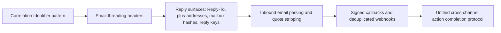

# Prior Art for Response Orchestration Protocol

## Executive summary

I did not find a single public standard, RFC, vendor API, or open-source project that is equivalent to the whole of a ROP-like protocol as you described it. What I did find is a dense stack of partial prior art: email threading and reply correlation through `Message-ID` / `In-Reply-To` / `References`; subaddressing and unique reply addresses; inbound email parsing and mailbox hashing; signed webhooks and callback verification; provider-specific deduplication IDs; quoted-text stripping; and helpdesk/forum systems that let email replies update existing objects. In other words, the closest thing that already exists is not one protocol but an ecosystem of fragmented mechanisms. On the evidence reviewed, the likely novelty in ROP is the synthesis: a transport-neutral protocol that unifies reply-correlation, authorization, revocation, typed lifecycle states, audit outcomes, and conformance fixtures across email, chat, SMS, webhooks, hosted inboxes, and agents. That synthesis has strong prior art underneath it, but I did not find a public specification that combines those pieces into one interoperable contract. citeturn31view0turn31view1turn31view4turn28view0turn30view0turn23view3turn24view0turn22view4turn14view0turn12search0turn12search1

## Comparison at a glance

The evolutionary picture is straightforward: the deepest roots are messaging correlation patterns and email threading; the next layer is operational reply surfaces such as `Reply-To`, plus-addressing, mailbox hashes, and app-specific reply keys; then come inbound parsers and quote stripping; then signed callback endpoints and deduplicated webhook receivers; and only after that do you get something close to ROP’s cross-channel action-completion model. That evolution is visible across standards, vendor docs, and OSS, but it stops short of a single unifying public protocol. citeturn31view6turn31view0turn31view1turn31view4turn28view0turn9view4turn22view1turn22view2turn22view4turn14view0turn12search0turn12search1

| ROP feature | Closest prior-art items | Coverage | Assessment | Sources |
|---|---|---:|---|---|
| Email reply correlation | RFC 5322 headers; Gmail threading; Exchange/Graph conversation objects | Partial | Mature for email, but email-only and object-specific | citeturn31view0turn25view0turn20view4turn26search2 |
| Tokenized address correlation | RFC 5233 subaddressing; Exchange Online plus addressing; Proton plus aliases; Fastmail plus addressing; Postmark `MailboxHash`; GitHub reply-to addresses; Discourse `reply_key` | Partial | Strong operational prior art, but fragmented and vendor-specific | citeturn31view1turn20view2turn20view3turn10search3turn9view4turn28view0turn13search1turn14view0 |
| Webhook / callback authentication | WebSub HMAC secret; RFC 9421 HTTP Message Signatures; Slack signing secret; GitHub secret signatures; Twilio signatures; SendGrid signed webhook; Mailgun webhook HMAC | Partial | Mature for HTTP ingress, but no single interoperable profile across vendors | citeturn31view4turn31view2turn22view1turn22view2turn23view3turn9view0turn9view2 |
| Public-ingest with async verification | WebSub 202-and-verify model | Partial | Very close for HTTP callbacks, not generalized to message replies across channels | citeturn31view4 |
| Idempotent receipt handling | GitHub `X-GitHub-Delivery`; Slack `event_id`; Twilio `MessageSid` and Event Streams `id`; Stripe event IDs; Idempotency-Key draft | Partial | Strong platform practice, weak cross-platform standardization | citeturn22view2turn24view0turn8view1turn22view4turn22view5turn31view3 |
| Quoted-history stripping / rejection | GitHub email replies strip signatures and quoted chains; Postmark `StrippedTextReply`; email_reply_parser; Talon | Partial | Strong implementation prior art, but not standardized as a protocol rule | citeturn28view0turn9view4turn12search0turn12search1turn12search5 |
| Registration / lease / revocation semantics | WebSub subscriptions, renewal, unsubscribe, lease expiry | Partial | Strong analogy for callback registrations, but not for multi-channel action completion | citeturn31view4 |
| Typed authorization rules | Discourse reply-key + user checks; FreeScout alternate-email checks; provider auth signals via SPF/DKIM/Authentication-Results | Partial | Pieces exist, but not as a portable authorization model | citeturn14view0turn14view2turn32view2turn20view1turn29view0 |
| Audit outcomes and conformance fixtures | Vendor delivery logs and webhook history; Twilio error codes; GitHub past deliveries; OSS tests | Partial | Logging exists; portable audit schema and fixture-based conformance do not appear standardized | citeturn22view3turn22view4turn7search12turn12search8 |
| Full transport-neutral action completion | WS-Addressing; WebSub; helpdesk/forum reply-by-email systems | No | I did not find a public equivalent that spans email, chat, SMS, webhook, hosted inbox, and agent workflows under one typed protocol | citeturn31view5turn31view4turn14view0turn14view3turn28view0 |

## Prior standards

The closest public standards ancestors are the entity["organization","IETF","internet standards body"] mail and HTTP families, plus the entity["organization","W3C","web standards body"] callback specifications. RFC 5322 standardizes the message format and the header universe that threading systems rely on; Gmail’s own threading rules explicitly require `threadId`, `References`, `In-Reply-To`, and matching `Subject`; and Microsoft Graph exposes custom Internet message headers and mailbox message objects, which is exactly the substrate a ROP adapter would need for email-channel embedding and recovery. This is foundational prior art for correlation, but it is not a workflow-completion protocol. citeturn31view0turn25view0turn20view4turn26search2

RFC 5233 is the clearest standards-track ancestor for token-in-address patterns. It formalizes subaddressing such as `user+detail@example.com`, and modern providers still expose that surface: Exchange Online enables plus addressing by default, Proton supports unlimited plus-address variations and allows replies from plus-addressed mail, and Fastmail supports plus and subdomain addressing. That makes ROP’s token-in-address design highly consistent with existing email practice, even if ROP’s token format, lifecycle, and authorization model go far beyond plain subaddressing. citeturn31view1turn20view2turn20view3turn10search3turn11search14

The best transport-neutral conceptual ancestors are WebSub, WS-Addressing, and entity["book","Enterprise Integration Patterns","hohpe woolf"]. WebSub defines subscription and unsubscription requests, lease expiration, 202 Accepted during asynchronous verification, a random challenge that must be echoed, unique callback URLs, and optional HMAC signing of delivered content. WS-Addressing defines transport-independent message identity and reply endpoints through `MessageID` and `ReplyTo`. Enterprise Integration Patterns gives the canonical “Correlation Identifier” abstraction: a reply carries the identifier that ties it back to the original request. Those three together are the cleanest standards/principles-level prior art for the “reply completes something elsewhere” idea. But none of them specifies mail/chat/SMS/webhook unification, quoted-history handling, sender authorization rules, or action-state outcomes. citeturn31view4turn31view5turn31view6

For adapter authentication, RFC 9421 is the strongest modern standards reference. It standardizes canonicalization, signature base construction, and attached signature metadata for HTTP messages. That does not solve all of ROP’s adapter-auth needs by itself, but it is the most natural standards anchor for any “trusted adapter” HTTP profile. The related ecosystem also matters: RFC 7601 standardizes `Authentication-Results` as the place where upstream mail-auth checks are conveyed to downstream software, and the IETF HTTPAPI idempotency-key work signals that the industry is pushing toward interoperable idempotent HTTP writes, even though the draft is not the whole answer for reply receipts. citeturn31view2turn32view2turn31view3

## Vendor implementations

On the product side, the strongest precedents come from entity["company","GitHub","software platform"], entity["company","Twilio","communications platform"], entity["company","Slack","workplace chat"], entity["company","SendGrid","email platform"], entity["company","Mailgun","email platform"], entity["company","Postmark","email service"], entity["company","Google","internet company"], entity["company","Microsoft","software company"], entity["company","Amazon","cloud company"], entity["company","Proton","email company"], and entity["company","Fastmail","email company"]. None of them exposes something called ROP, but together they cover nearly every substrate that ROP wants to standardize: unique reply surfaces, inbound parsing, channel-native metadata, callback signatures, dedup IDs, retries, and provider-specific lifecycle behavior. citeturn28view0turn8view1turn22view1turn9view3turn30view0turn9view4turn25view0turn20view4turn20view1turn20view3turn10search3

For inbound email handling, the prior art is especially strong. SendGrid’s Inbound Parse webhook posts the raw headers, SMTP envelope, subject, sender IP, text/HTML bodies, spam score, and character sets to an HTTP endpoint. Mailgun routes let you match incoming recipients, then forward to HTTP, forward to another email address, or store temporarily. Postmark’s inbound webhook uses a unique inbound address, exposes `MailboxHash` from plus-addressing, and provides `StrippedTextReply` when it can isolate only the new reply text. Amazon SES receipt rules process incoming mail by recipient, can add headers, bounce, invoke Lambda, publish to SNS, or deliver to S3, and they surface authentication and malware scanning results during rule evaluation. Those are near-direct precedents for ROP-style channel adapters, but each one is provider-specific, and none defines a portable registration, revocation, or typed outcome model. citeturn29view0turn29view3turn29view4turn30view0turn9view4turn20view1

For reply-by-email correlation, GitHub is one of the clearest public examples. GitHub says the `reply-to` address on each notification identifies both the thread and the account that the reply will be posted from; it also strips signatures and quoted reply chains when they are marked in conventional ways. Gmail, meanwhile, documents the exact requirements for adding messages to a thread, and Microsoft Graph documents custom `x-` Internet headers on messages. Together, that is strong prior art for three separate ROP ideas: embedding correlation material in routable email surfaces, combining transport-native threading with application-native identifiers, and treating quoted history as semantically different from new content. citeturn28view0turn25view0turn20view4

For chat, SMS, and generic callbacks, the field is mature but fragmented. Slack supports structured message metadata and signs incoming HTTP requests with `X-Slack-Signature`; its Events API provides a globally unique `event_id`, requires a quick 2xx acknowledgment, and retries failed deliveries. Twilio signs webhooks with `X-Twilio-Signature`, exposes a stable `MessageSid` for inbound messaging, and its Event Streams product is explicitly at-least-once, with duplicate events identified by shared event `id`. GitHub webhooks expose `X-GitHub-Delivery` and HMAC signatures; best-practices docs tell receivers to use secrets, acknowledge quickly, and key logic off that delivery ID. SendGrid’s Event Webhook supports ECDSA signatures and OAuth 2.0 client-credentials protection, while Mailgun webhook verification uses timestamp + token + HMAC and explicitly suggests caching the token to prevent replay. Stripe’s docs, although not email-specific, are among the clearest official statements of idempotent receiver behavior: keep your own processing state, dedupe by event identity, and expect automatic retries for undelivered events. This is exactly the operational terrain that ROP’s adapter-auth and idempotency sections are trying to normalize. citeturn8view2turn22view1turn24view0turn24view1turn8view1turn23view3turn22view4turn22view2turn22view3turn9view0turn9view2turn22view5

## Open-source projects and research

Among open-source systems, entity["organization","Discourse","forum software"], entity["organization","Chatwoot","support platform"], entity["organization","FreeScout","helpdesk software"], and entity["company","Best Practical","rt vendor"] are the clearest practical antecedents. Discourse uses a `reply_key` embedded in reply-by-email addresses, checks that the replying user matches the key, and also has paths for forwarded mail and `Message-ID`-based association. Chatwoot’s “conversation continuity” explicitly says it reads `Message-ID`, `References`, and custom thread identifiers to map email replies back into the original live-chat conversation. FreeScout lets users update conversations from email replies, restricts who may reply to notifications based on the sender’s known addresses, and distinguishes replies from forwards in its email-command surface. Request Tracker’s public docs also emphasize that ticket replies can happen directly by email. These are not standards, but they are strong real-world evidence that the problem ROP tackles is both common and implementation-heavy. citeturn14view0turn14view3turn14view2turn14view4turn27search10

On the quoted-history problem, open source is ahead of standards. GitHub open-sourced `email_reply_parser` specifically to recover only the visible reply portion of an email. Mailgun’s Talon is a dedicated quotation and signature extraction library that strips blockquotes, `gmail_quote`, and Microsoft quotation patterns. Those libraries are direct prior art for ROP’s quoted-history rejection logic, but they also highlight a key point: there is no shared protocol standard here. What exists is a body of heuristics, corpora, and parser implementations. citeturn12search0turn12search1turn12search5turn12search17

The academic literature points more to building blocks than to an equivalent protocol. The Correlation Identifier pattern is the canonical conceptual abstraction. WS-Addressing and BPEL correlation sets are longstanding transport-neutral ways to bind replies to requests. Research on email thread reconstruction, quote modeling, and callback correlation shows that the hard parts are correlation, reconstruction, and extraction rather than transport syntax alone. One useful modern analogue is Smart Contract Invocation Protocol research, where callbacks carry a copy of the correlation identifier so the client can match request and response. The pattern is familiar; what appears less common is turning it into a user-facing, cross-channel reply-completion spec with lifecycle states, revocation, and conformance fixtures. citeturn31view6turn31view5turn16search5turn17search7turn17search1turn16search0

## Gaps, interoperability, and patent risks

The main gap between ROP and prior art is combinatorial. Existing systems usually solve one slice: email threading, inbound mail routing, webhook authentication, event deduplication, or helpdesk reply handling. In the materials reviewed, I did not find a public artifact that combines all of the following in one transport-neutral protocol: explicit registration and revocation endpoints; adapter-auth modes covering trusted and public ingress; typed authorization rules for sender identity and scope; normalized lifecycle states such as active, consumed, expired, superseded, revoked, and deleted; quoted-history as an explicit non-completing outcome; audited response outcomes; and fixture-based conformance. That conclusion is an inference from the standards and implementations above, but it is the central answer to the “does an equivalent already exist?” question: not as a single public protocol that I could find. citeturn31view4turn31view5turn28view0turn14view0turn14view3turn22view1turn22view2turn22view4

The interoperability risk is therefore not “no prior art,” but “too much incompatible prior art.” Gmail threading requires a specific combination of headers and subject discipline. Graph supports custom headers but in a Microsoft-shaped model. Slack has signed HTTP requests and message metadata, but its envelope, retries, and IDs are Slack-specific. Twilio’s signature verification depends on the exact URL and encoded parameters; it warns that parameters may evolve. GitHub, Twilio, Slack, SendGrid, Mailgun, and Stripe all use different header names, retry windows, payload encodings, and dedup keys. An implementer who wants ROP adapters for all of them will need canonical mapping tables and well-defined precedence rules, or else “ROP-compatible” will fragment into provider-specific dialects. citeturn25view0turn20view4turn24view0turn24view1turn22view1turn23view3turn22view2turn22view4turn9view0turn9view2turn22view5

ROP’s token model is also compatible with existing systems, but it inherits their leakage risks. GitHub’s reply-to addresses remain valid until password reset. Postmark and RFC 5233-style addressing show how tokens or tags naturally sit in recipient addresses. SendGrid explicitly warns that unique arguments are stored long term and should not include PII. WebSub recommends callback URLs that are unique and hard to guess. So the operational lesson is clear: opaque high-entropy tokens are normal, but any token placed into routable addresses, subjects, metadata, or callback URLs must be treated as potentially exposed through forwarding, previews, screenshots, logs, and vendor retention. citeturn28view0turn9view1turn31view1turn31view4

On patent and IP risk, I did not find an obvious public patent that claims the whole ROP combination end to end. I did find adjacent patents that matter. US7406501B2 describes embedding a token in `Reply-To` or `From`, using a token table, verifying that the reply sender matches the expected email address, and invalidating tokens after suspicious mismatches. US8150924B2 covers associating emails with conversations. US20180115595A1 covers configurable webhook validation across arbitrary applications. There is also published application material around email-based token authentication that allows multiple email addresses to authenticate with a token. So the practical read is: there appears to be a crowded adjacent space around tokenized email replies, conversation association, and webhook validation, but I did not see a public patent that obviously captures the whole transport-neutral ROP synthesis. A serious commercial launch would still warrant a jurisdiction-specific freedom-to-operate review and claim charting, especially around email-token routing and reply authorization. citeturn19view0turn19view1turn19view2turn19view3

## Recommended references to cite

If the goal is to make the ROP spec legible to implementers and defensible as grounded in existing practice, the most useful citation strategy is to cite one standards source for each concept, then one or two vendor/OSS sources that show the concept in production. The table below is the shortest practical set I would cite in the spec itself. citeturn31view0turn31view1turn31view2turn31view4turn31view5turn32view2turn25view0turn28view0turn22view1turn23view3turn9view4turn30view0turn14view0turn12search0turn12search1

| Reference | Why cite it | URL | Source |
|---|---|---|---|
| RFC 5322 | Canonical email message format and header substrate | https://www.rfc-editor.org/rfc/rfc5322.html | citeturn31view0 |
| RFC 5233 | Standards-track subaddressing / plus-addressing | https://www.rfc-editor.org/rfc/rfc5233.html | citeturn31view1 |
| RFC 7601 | `Authentication-Results` for conveying mail-auth decisions | https://www.rfc-editor.org/rfc/rfc7601.html | citeturn32view2 |
| RFC 9421 | Standard HTTP message signatures for trusted adapters | https://www.rfc-editor.org/rfc/rfc9421.html | citeturn31view2 |
| WebSub | Subscription, verification, lease, revoke analogue for public ingest | https://www.w3.org/TR/websub/ | citeturn31view4 |
| WS-Addressing 1.0 Core | Transport-neutral `MessageID` / `ReplyTo` model | https://www.w3.org/TR/2006/REC-ws-addr-core-20060509/ | citeturn31view5 |
| Gmail threads guide | Real production rules for threading and reply association | https://developers.google.com/workspace/gmail/api/guides/threads | citeturn25view0 |
| GitHub notifications | Reply-by-email address identifies thread and account; strips quoted chains | https://docs.github.com/en/subscriptions-and-notifications/get-started/configuring-notifications | citeturn28view0 |
| Slack request verification | Signed-request pattern for chat adapters | https://docs.slack.dev/authentication/verifying-requests-from-slack/ | citeturn22view1 |
| Slack message metadata | Structured hidden-ish metadata surface in chat messages | https://docs.slack.dev/messaging/message-metadata/ | citeturn8view2 |
| Twilio inbound message webhook | SMS ingress payload shape and stable message ID | https://www.twilio.com/docs/messaging/guides/webhook-request | citeturn8view1 |
| Twilio webhook security | Signature verification details, exact URL/body sensitivity | https://www.twilio.com/docs/usage/webhooks/webhooks-security | citeturn23view3 |
| SendGrid Inbound Parse | Inbound email parsing surface | https://www.twilio.com/docs/sendgrid/for-developers/parsing-email/setting-up-the-inbound-parse-webhook | citeturn9view3 |
| SendGrid signed webhook | Asymmetric or OAuth-protected webhook ingress | https://www.twilio.com/docs/sendgrid/for-developers/tracking-events/getting-started-event-webhook-security-features | citeturn9view0 |
| Mailgun routes | Recipient-based inbound routing to HTTP/email/store | https://documentation.mailgun.com/docs/mailgun/api-reference/send/mailgun/routes | citeturn30view0 |
| Mailgun webhook security | HMAC + timestamp/token replay-mitigation pattern | https://documentation.mailgun.com/docs/mailgun/user-manual/webhooks/securing-webhooks | citeturn9view2 |
| Postmark inbound webhook | Unique inbound addresses, `MailboxHash`, `StrippedTextReply` | https://postmarkapp.com/developer/webhooks/inbound-webhook | citeturn9view4 |
| Amazon SES receiving | Receipt-rule model and auth result availability | https://docs.aws.amazon.com/ses/latest/dg/receiving-email-concepts.html | citeturn20view1 |
| Discourse receiver code | OSS example of reply keys, sender checks, and forwarding logic | https://github.com/discourse/discourse/blob/main/lib/email/receiver.rb | citeturn14view0 |
| GitHub email_reply_parser | OSS example of extracting visible reply content | https://github.com/github/email_reply_parser | citeturn12search0 |
| Mailgun Talon | OSS quote/signature extraction for email replies | https://github.com/mailgun/talon | citeturn12search1 |

## Suggested spec changes for compatibility

The most valuable compatibility change would be to define explicit mapping profiles instead of only abstract channel adapters. For email, that means normative guidance for `Message-ID`, `In-Reply-To`, `References`, `Reply-To`, subaddressing, custom `X-` headers, and when each surface takes precedence. Gmail’s documented threading rules, Graph custom headers, GitHub’s reply-to correlation, and Postmark’s `MailboxHash` show that these surfaces are all real, but they are not interchangeable unless the spec says exactly how they map into the same ROP registration and receipt model. citeturn25view0turn20view4turn28view0turn9view4turn31view1

For adapter authentication, I would add one standards-based profile and one pragmatic profile. The standards profile should reference RFC 9421 HTTP Message Signatures. The pragmatic profile should explicitly model vendor-style shared-secret verification of the “raw request plus selected headers/body hash” sort used by Slack, GitHub, Twilio, Mailgun, and WebSub HMAC delivery. If you want mTLS or JWT-based adapter auth, cite those as optional profiles rather than inventing bespoke fields; in practice, the market today is much more HMAC/signature-header driven than JWT-signed inbound callbacks. citeturn31view2turn22view1turn22view2turn23view3turn9view2turn31view4turn32view1

For idempotency, define a three-level hierarchy: provider-native event ID when present, provider-derived stable synthesis when not, and optional HTTP idempotency header alignment. That mirrors what Slack, GitHub, Twilio, and Stripe already force receivers to do. If the spec wants portability, it should explicitly say how `receipt_idempotency_key` maps to `event_id`, `X-GitHub-Delivery`, `MessageSid`, Twilio Event Streams `id`, and Stripe event IDs, and when a synthesized key is allowed. citeturn24view0turn22view2turn8view1turn22view4turn22view5turn31view3

For quoted-history handling, I would keep the protocol rule strict but make the algorithm pluggable. There is no standards-track way to detect quoted history, and production systems rely on heuristics. The spec should therefore define outcomes such as `quoted_token_only` and `manual_review_required`, then profile known parser classes rather than implying that one regex is universal. GitHub’s reply stripping, Postmark’s `StrippedTextReply`, `email_reply_parser`, and Talon are the right references here. citeturn28view0turn9view4turn12search0turn12search1

For authorization and privacy, I would add two compatibility hooks. First, allow adapters to pass mail-auth outcomes using `Authentication-Results`-style data so that sender trust can consume DKIM/SPF/DMARC-equivalent signals without hardwiring a particular provider. Second, harden the token guidance: tokens should be opaque, high-entropy, short-lived, revocable, and never encode tenant names, human-readable action titles, or PII. That recommendation is not theoretical; it follows directly from how plus-addresses, reply-to surfaces, unique arguments, and callback URLs get logged, forwarded, previewed, and retained by third parties. citeturn32view2turn20view1turn29view0turn9view1turn31view4

## Open questions and limitations

This review was broad rather than exhaustive. The patent check was only a high-level public search, not a legal freedom-to-operate analysis. I also did not find a single prior-art corpus that exhaustively covers hosted-inbox and agent-mail workflows, so the conclusion that “no exact equivalent exists” should be read as “no exact equivalent surfaced in the public standards, vendor docs, OSS, and public patent material reviewed here,” not as a proof of absence.